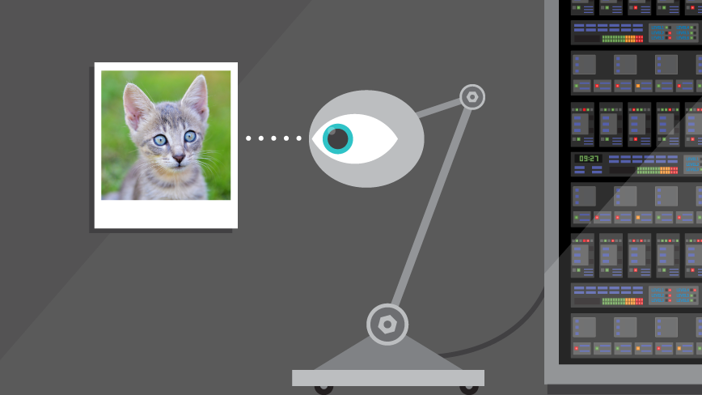

# Computer Vision Library

 

  

  

    Building a computer vision library from the ground up mostly in c.
  

## Course Material

[The Ancient Secrets of Computer Vision - University of Washington, Spring 2018](https://courses.cs.washington.edu/courses/cse455/18sp/)
